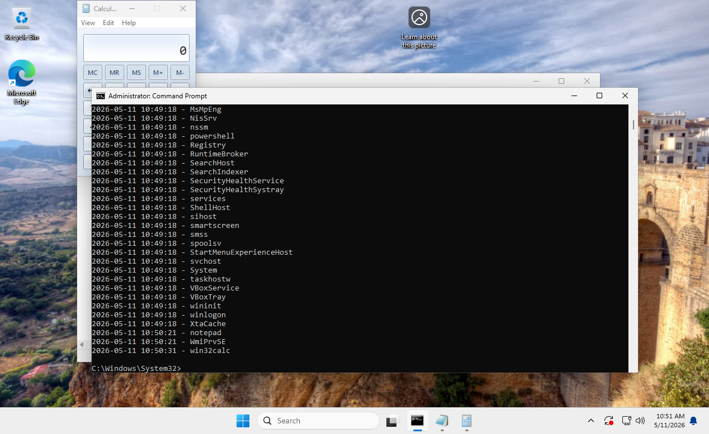
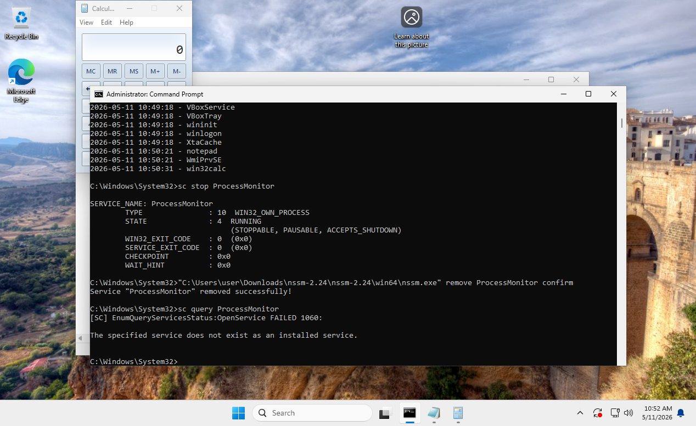
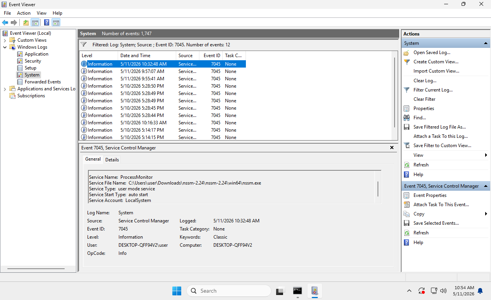

## Создание PowerShell-скрипта

Для мониторинга новых процессов был создан PowerShell-скрипт `process-monitor.ps1` в каталоге `C:\Temp`.

Скрипт работает в течение 5 минут, получает список запущенных процессов и записывает новые процессы в лог-файл `C:\Temp\process-log.txt`.


## Создание службы через NSSM

Для запуска PowerShell-скрипта в виде службы Windows использовалась утилита NSSM (Non-Sucking Service Manager).

Была создана служба `ProcessMonitor`, которая запускает скрипт `C:\Temp\process-monitor.ps1`.

```cmd
"C:\Users\user\Downloads\nssm-2.24\nssm-2.24\win64\nssm.exe" install ProcessMonitor powershell.exe "-ExecutionPolicy Bypass -File C:\Temp\process-monitor.ps1"
```


## Запуск службы

После создания служба `ProcessMonitor` была запущена командой:

```cmd
sc start ProcessMonitor
```

Команда sc start перевела службу в состояние START_PENDING, что означает успешный запуск PowerShell-скрипта


После запуска службы были открыты приложения `Notepad` и `Calculator`.

Для просмотра содержимого лог-файла использовалась команда:

```cmd
type C:\Temp\process-log.txt
```

В лог-файле появились новые процессы, включая notepad и win32calc, что подтверждает корректную работу скрипта




## Остановка и удаление службы

После завершения мониторинга служба `ProcessMonitor` была остановлена и удалена с помощью `nssm`.

```cmd
sc stop ProcessMonitor

"C:\Users\user\Downloads\nssm-2.24\nssm-2.24\win64\nssm.exe" remove ProcessMonitor confirm

sc query ProcessMonitor
```

Команда `sc stop ProcessMonitor` остановила службу
Команда `nssm remove ProcessMonitor confirm` удалила службу из системы.

Повторная проверка с помощью `sc query ProcessMonitor` вернула ошибку 1060:
```cmd
The specified service does not exist as an installed service.
```
Это подтверждает, что служба была успешно удалена



## Поиск событий создания службы в Event Viewer

После создания службы `ProcessMonitor` были проверены системные журналы Windows.

Для этого был открыт:

`Event Viewer → Windows Logs → System`

И выполнена фильтрация по `Event ID 7045`.

Событие `7045` от источника `Service Control Manager` подтверждает установку новой службы в системе.

В событии указаны следующие параметры:

- **Service Name:** `ProcessMonitor`
- **Service File Name:** `C:\Users\user\Downloads\nssm-2.24\nssm-2.24\win64\nssm.exe`
- **Service Type:** `user mode service`
- **Service Start Type:** `auto start`
- **Service Account:** `LocalSystem`

Это подтверждает, что служба `ProcessMonitor` была успешно создана и зарегистрирована через `nssm.exe`.


