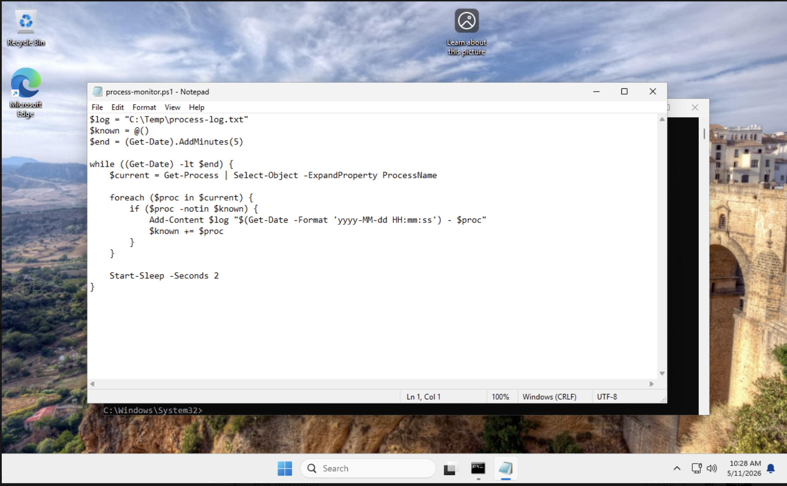
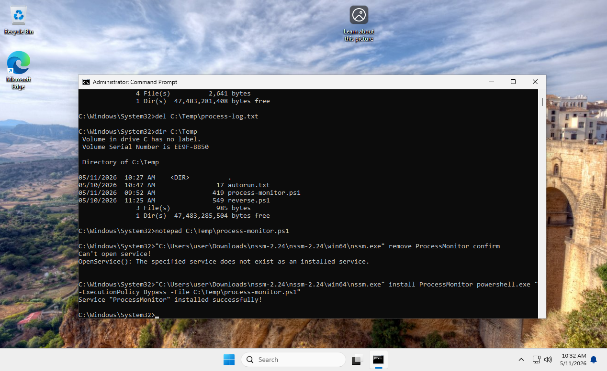
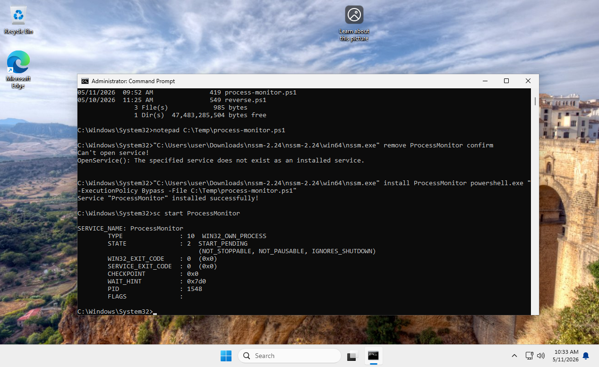

## 1. Создание PowerShell-скрипта

Для мониторинга новых процессов был создан PowerShell-скрипт `process-monitor.ps1` в каталоге `C:\Temp`.

Скрипт работает в течение 5 минут, получает список запущенных процессов и записывает новые процессы в лог-файл `C:\Temp\process-log.txt`.




## 2. Создание службы через NSSM

Для запуска PowerShell-скрипта в виде службы Windows использовалась утилита NSSM (Non-Sucking Service Manager).

Была создана служба `ProcessMonitor`, которая запускает скрипт `C:\Temp\process-monitor.ps1`.

```cmd
"C:\Users\user\Downloads\nssm-2.24\nssm-2.24\win64\nssm.exe" install ProcessMonitor powershell.exe "-ExecutionPolicy Bypass -File C:\Temp\process-monitor.ps1"
```




## 3. Запуск службы

После создания служба `ProcessMonitor` была запущена командой:

```cmd
sc start ProcessMonitor
```

Команда sc start перевела службу в состояние START_PENDING, что означает успешный запуск PowerShell-скрипта


